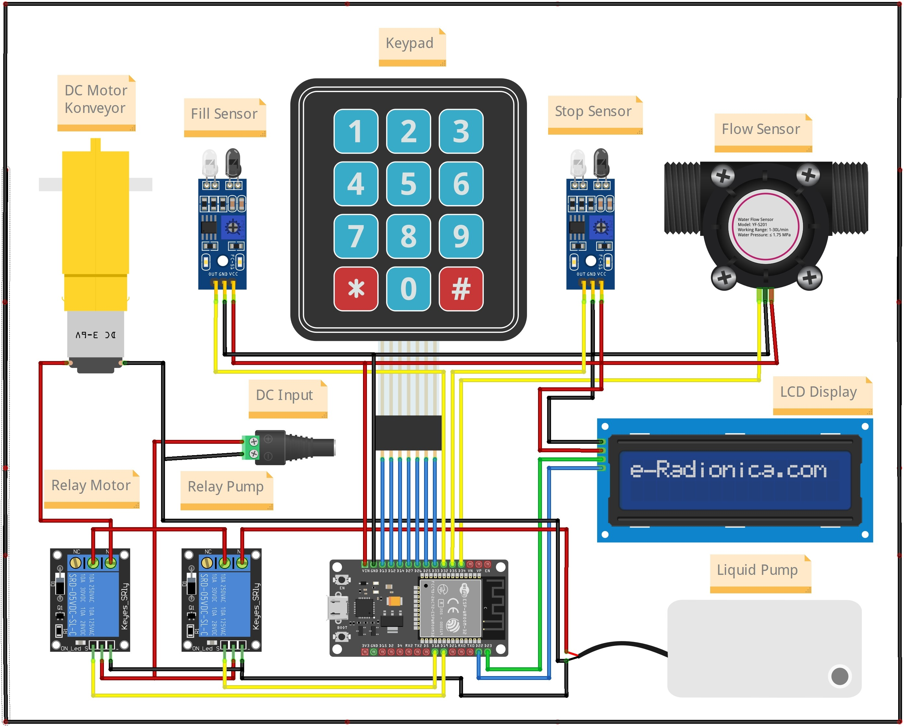
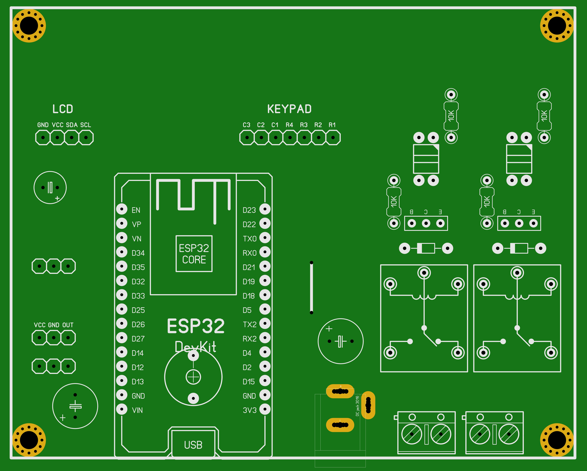
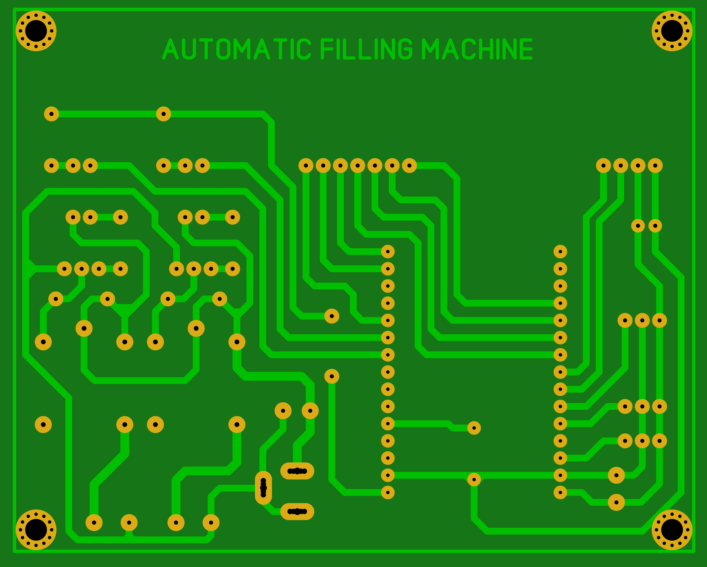

## Automatic Filling Machine

Adalah alat yang bertujuan untuk mengisi botol dengan cairan tertentu secara otomatis yang berjalan diatas conveyor.
Alat ini juga dapat dioperasikan melalui Telegram Bot untuk mengatur jumlah interval pengisian cairan serta mengetahui jumlah botol yang sudah terisi. Selain melalui Telegram, pengguna juga dapat mengaturnya melalui Keypad. Terdapat juga LCD 16X2 untuk menampilkan data dan jumlah botol yang sudah terisi.

---

### Cara kerja Alat

Ketika pertama kali dihidupkan, alat akan mencoba menghubungkan ke jaringan WiFi yang sudah dikonfigurasikan. Jika berhasil terhubung maka pengguna diminta untuk mengatur interval waktu pengisian tiap botol. Hal ini dapat dilakukan melalui keypad maupun Telegram. Untuk menjalankannya pengguna tinggal menekan tombol `#` atau disini digunakan sebagai tombol start. Setelah itu Conveyor akan hidup untuk melakukan pengisian botol secara bergantian. Terdapat 2 sensor yang berfungsi untuk mngehentikan Conveyor guna melakukan pengisian botol serta menghitung jumlah botol yang sudah terisi. Sedangkan untuk tombol `*` digunakan untuk menghentikan proses pengisian dan kembali ke menu atau tampilan untuk mengatur waktu pengisian.

- Fungsi Tombol Pada Keypad

  - Tombol angka => digunakan untuk memasukkan nilai tertentu.
  - Tombol `*` => digunakan untuk stop / menghentikan alat.
  - Tombol `#` => digunakan untuk start / menjalankan alat.

- Fungsi Perintah Pada Telegram

  - `/cekbotol` => untuk mengetahui jumlah botol yang sudah terisi.
  - `/cektimer` => untuk mengetahui interval waktu pengisian botol.
  - `/setinterval` => untuk mengatur interval pengisian botol.
  - `/cekdebit` => untuk mengetahui debit air yang sudah digunakan.
  - `/reset` => untuk me-reset pengaturan pada alat.

---

### Hardware

- ESP32 Devkit V1
- Keypad 4X3
- Flow Sensor YF-S201
- LCD 16X2 I2C
- 5V Relay Module
- IR Sensor Module
- Motor DC Gearbox
- 12V DC Water Pump

---

### Wiring Diagram

Berikut adalah wiring diagram dari alat Automatic Filling Machine

    

---

### Prototype PCB

Selain membuat wiring diagram, kami juga membuat Printed Circuit Board (PCB). Berikut adalah penampakannya:

- PCB TOP

    

- PCB BOTTOM

    

---
