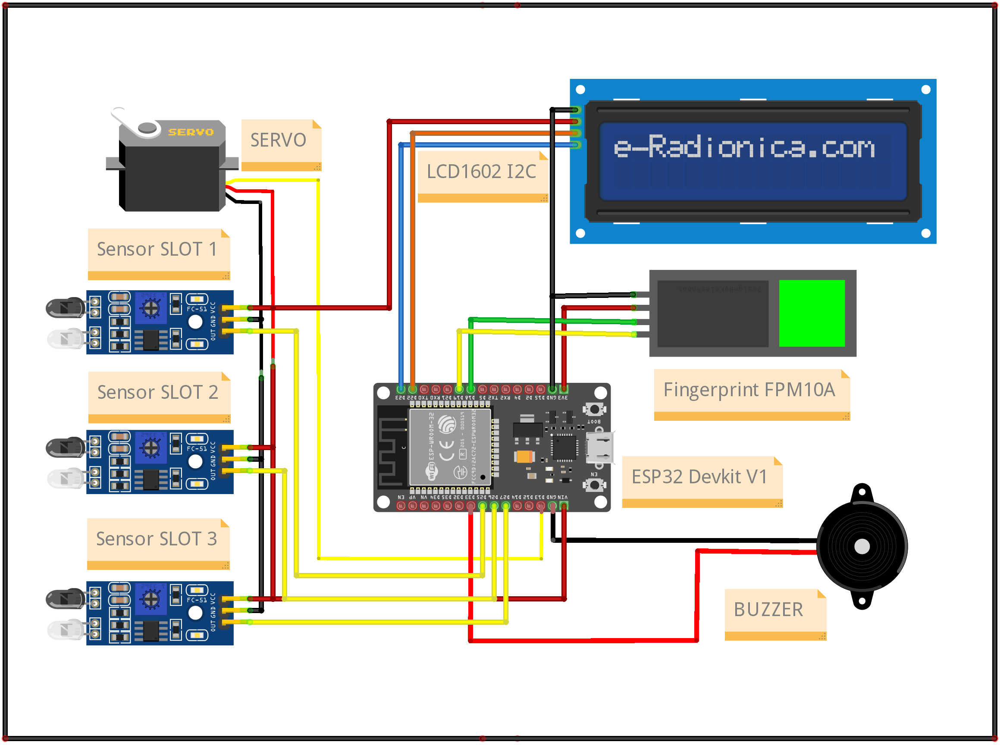
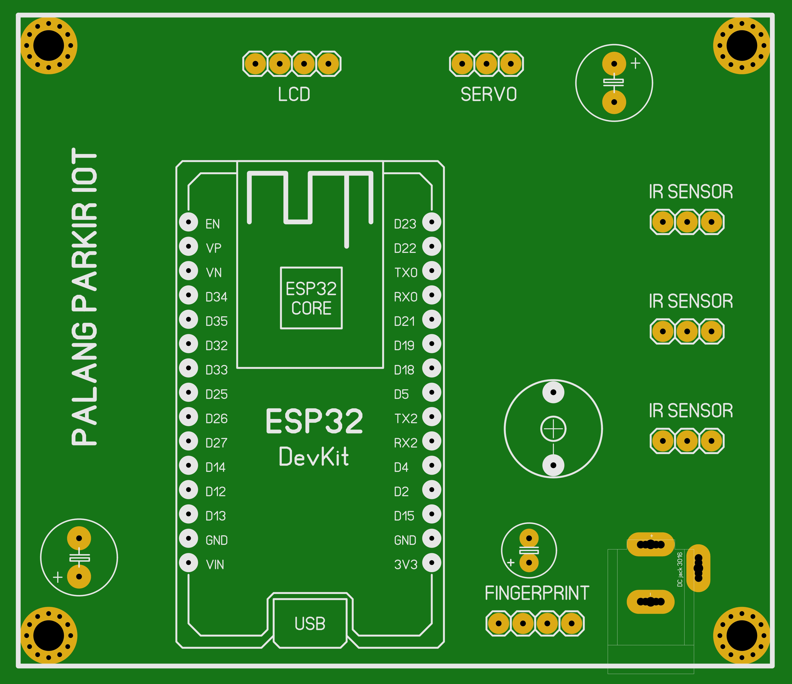
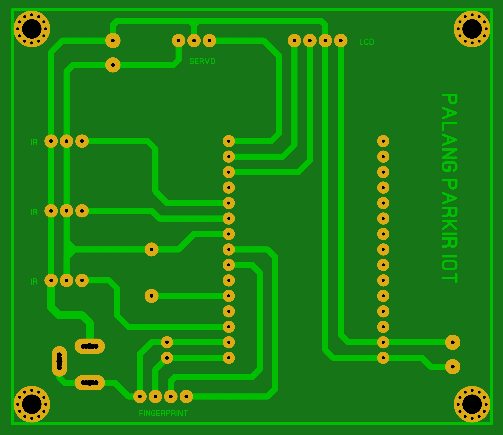

## Smart Palang Parkir

Adalah alat yang berfungsi untuk memantau sebuah lahan parkir serta membatasi akses masuk melalui palang parkir yang sudah diintegrasikan dengan perangkat fingerprint. Untuk membuka akses palang pengguna dapat melakukan scan fingerprint pada sensor. Jika sidik jari pengguna terdaftar maka palang akan terbuka dan sebaliknya. Terdapat 3 buah slot parkir yang bisa digunakan pengguna dan setiap slot terdapat sensor untuk mendeteksi apakah slot tersebut masih kosong atau sudah digunakan. Selain itu, juga terdapat LCD 16X2 untuk menampilkan data status slot parkir serta menampilkan data pengguna ketika melakukan akses melalui fingerprint. Alat ini juga sudah terintegrasi dengan Telegram Bot untuk memantau kondisi slot parkir serta mengontrol akses palang tanpa harus melakukan scan fingerprint.

---

### Cara Kerja Alat

Ketika pertama kali dihidupkan, alat akan mencoba menghungkan kejaringan WiFi yang sudah dikonfigurasikan. Jika berhasil terhubung maka alat sudah bisa dioperasikan. Tampilan pada LCD menampilkan data slot parkir serta data pengguna ketika mengakses sensor fingerprint. Terdapat juga buzzer yang difungsikan sebagai indikator ketika sensor fingerprint diakses dan kondisi slot parkir penuh atau terisi semua. Selain itu, Telegram difungsikan untuk memantau kondisi slot parkir serta mengontrol akses palang secara langsung. Berikut adalah beberapa perintah yang terdapat pada Telegram Bot:

- `/cekslot` => untuk mengetahui kondisi slot parkir.
- `/bukapalang` => untuk membuka palang secara langsung.
- `/menu` => untuk menampilkan menu/perintah dalam bot.

---

### Hardware

- ESP32 Devkit V1
- IR Sensor Module
- Fingerprint Sensor FPM10A
- Motor Servo
- Active Buzzer
- LCD 16X2 I2C

---

### Wiring Diagram

Berikut adalah wiring diagram dari alat Smart Palang Parkir

    

---

### Prototype PCB

Selain membuat wiring diagram, kami juga membuat Printed Circuit Board (PCB). Berikut adalah penampakannya:

- PCB TOP

    

- PCB BOTTOM

    

---

#### Catatan !

Project ini bersifat private, jika anda membutuhkan file lain seperti source-code program dan file pendukung lainnya silahkan hubungi saya melalui tautan sosial media pada bio profile ini.

[Traktir saya kopi](https://www.buymeacoffee.com/thoriktk)

---
