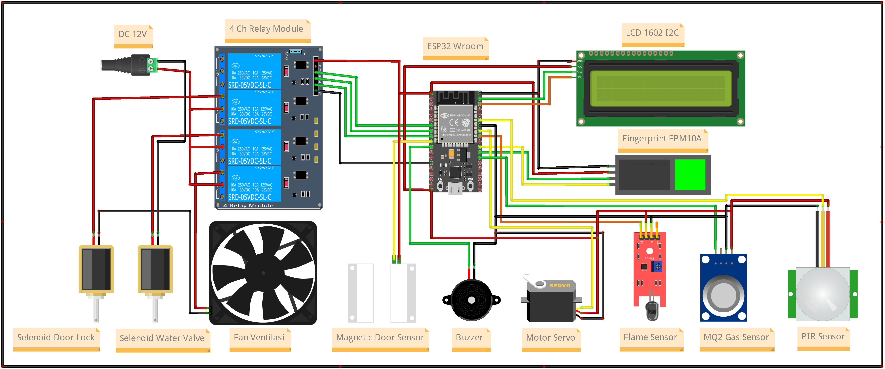
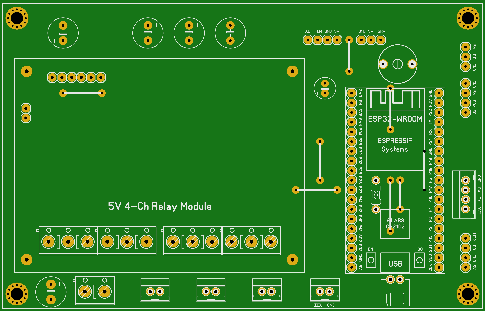
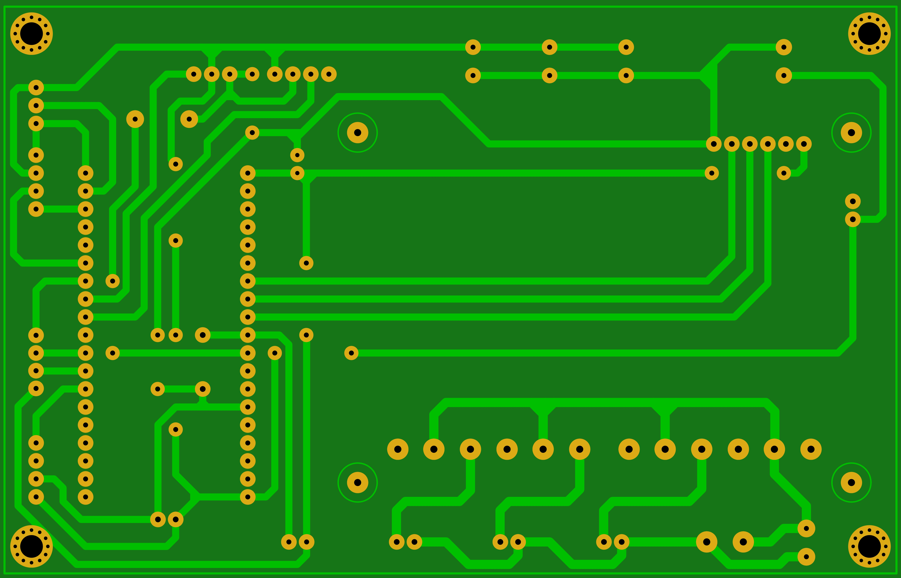

## Smart Kitchen

Adalah alat yang berfungsi untuk memantau dan memonitoring kondisi dapur melalui Telegram Bot. Selain itu pengguna juga bisa memonitoring melalui LCD 16X2 yang terdapat pada alat ini. Tujuan utama dari alat ini adalah untuk otomasi keamanan dapur yang didalamnya terdapat sensor gas dengan seri `MQ-2` yang dapat memicu alat untuk menghidupkan kipas sebagai sirkulasi udara dan membuka `Selenoid Water Valve` jika sensor mendeteksi adanya api yang membahayakan. Alat ini juga dilengkapi dengan sensor fingerprint sebagai akses pintu bagi pengguna yang sudah terdaftar atau terverifikasi.

---

### Cara Kerja Alat

Ketika pertama kali dihidupkan, alat akan mencoba menghubungkan kejaringan WiFi yang sudah dikonfigurasikan melalui WiFiManager. Selain konfigurasi WiFi, WiFiManager juga digunakan untuk mengkonfigurasi pengaturan Teelegram Bot yaitu Token dan chatID. Hal ini bertujuan untuk memudahkan pengguna dalam melakukan konfigurasi tanpa harus memprogram ulang dan tentunya lebih fleksibel jika sewaktu-waktu pengguna ingin mengganti konfigurasi WiFi dan Telegram. Jika berhasil terhubung maka alat menjadi mode standby dan LCD akan menampilkan tampilan `Smart Kitchen Montor`. Pengguna dapat mengontrol dan memonitoring melalui Telegram Bot, adapun beberapa perintahnya adalah sebagai berikut:

- `/cekapi` => Untuk mengeathui keberadaan api.
- `/cekgas` => Untuk mengeathui kadar gas.
- `/buka` => Untuk membuka kunci/akses pintu.
- `/enfan` => Untuk menghidupkan kipas sebagai sirkulasi udara.
- `/disfan` => Untuk mematikan kipas.
- `/daftar` => Untuk mendaftar ID fingerprint / pengguna baru.
- `/reset` => Untuk menghapus konfigurasi alat terutama WiFi.

dalam mode standby, tampilan pada LCD akan bergantian menampilkan data, diantaranya adalah data waktu, keberadaan api, kadar gas, dan status pintu apakah terbuka atau tertutup.

Ketika sensor mendeteksi kadar gas terlalu tinggi maka tampilan LCD akan otomatis menampilkan informasi `PERINGATAN! Kadar Gas Tinggi` dan menghidupkan kipas sebagai sirkulasi udara serta mengirimkan notifikasi berupa pesan ke Telegram.

Selanjutnya, ketika sensor mendeteksi adanya api yang membahayakan maka secara otomatis LCD akan menampilkan informasi `PERINGATAN! Terdeteksi API` dan menghidupkan Selenoid Water Valve untuk mengalirkan air yang bertujuan untuk memadamkan api. Selain itu, pada alat ini terdapat sensor gerak yaitu `PIR` yang difungsikan untuk mendeteksi keberadaan seseorang didalam dapur. mekanisme ini bertujuan untuk menutup pintu secara otomatis jika tidak terdeteksi adanya keberadaan seseorang didapur, tetapi masih ada sesorang didalam maka pintu tidak akan menutup sampai sesorang tersebut keluar. Hal ini untuk mencegah adanya korban jiwa dan meminimalisir dampak yang ditimbulkan jika suatu ketika terjadi kebakaran atau hal yang tidak diinginkan.

Pada alat ini juga dilengkapi buzzer sebagai indikasi jika kondisi-kondisi tersebut benar-benar terjadi agar pengguna dapat segera melakukan tindakan atau langkah mitigasi.

---

### Hardware

- ESP32 Wroom
- LCD 16X2 I2C
- Fingerprint Sensor FPM10A
- 4ch Relay DC 5V
- Selenoid Door Lock
- Selenoid Water Valve
- Kipas DC 12V
- Magnetic Door Sensor
- Active Buzzer
- Motor Servo
- Flame Sensor
- MQ-2 Gas Sensor
- PIR Sensor

---

### Wiring Diagram

Berikut adalah wiring diagram dari alat Smart Kitchen

    

---

### Prototype PCB

Selain membuat wiring diagram, kami juga membuat Printed Circuit Board (PCB). Berikut adalah penampakannya:

- PCB TOP

    

- PCB BOTTOM

    

---

#### Catatan !

Project ini bersifat private, jika anda membutuhkan file lain seperti source-code program dan file pendukung lainnya silahkan hubungi saya melalui tautan sosial media pada bio profile ini.

[Traktir saya kopi](https://www.buymeacoffee.com/thoriktk)

---
