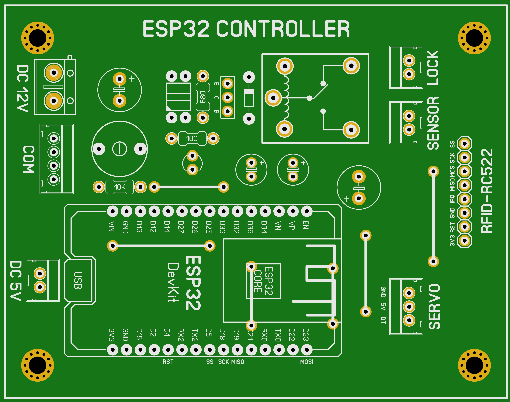

## Sistem Keamanan Rumah

Adalah alat yang berfungsi untuk memantau dan memonitoring kondisi rumah khususnya diteras atau didepan pintu. Hampir mirip dengan CCTV tetapi yang menjadi pembeda adalah pada alat ini dilengkapi dengan sensor gerak yaitu `PIR` yang bertujuan untuk memicu pengambilan gambar maupun video ketika terdeteksi adanya gerakan atau seseorang. Alat ini juga terintegrasi dengan Telegram Bot sebagai sarana kontrol dan monitoring antara alat dengan pengguna atau pemilik rumah. Selain itu, pada alat ini juga terintegrasi dengan `RFID` untuk membtasi akses membuka pintu.

---

### Cara Kerja Alat

Pada alat ini dipisah menjadi 2 bagian yang mempunyai cara kerja masing-masing, berikut penjelasannya:

- Motion Capture

  Ketika pertama kali dihidupkan, alat akan mencoba menghubungkan kejaringan WiFi yang sudah dikonfugasi melalui WiFiManager. Selain untuk melakukan konfiguasi WiFi, WiFiManager juga difungsikan untuk melakukan konfigurasi Telegram Bot. Hal ini bertujuan untuk memudahkan pengguna saat melakukan konfigurasi tanpa harus memprogram ulang serta membuat alat lebih fleksibel jika suatu saat pengguna ini mengganti atau mengubah konfigurasi tersebut.

  Ketika berhasil terhubung maka alat masuk keadaan standby dan siap untuk mendeteksi gerakan atau seseorang melalui sensor `PIR`. Ketika sensor mendeteksi adanya gerakan atau seseorang maka secara otomatis alat akan mengambil gambar atau foto dan juga mengambil video untuk kemudian dikirimkan sebagai pesan ke Telegram pengguna.
  Disisi lain, pada alat ini juga akan mengirim sebuah data dalam format tertentu melalui komunikasi serial `UART` ke alat yang kami sebut `Base Controller`. Selanjutnya pada `Base Controller` data tersebut akan diproses sesuai dengan permintaan dan data yang diterima.

  Pengguna juga dapat melakukan kontrol dan monitoring melalui Telegram bot. Ada beberapa perintah yang bisa dijalankan oleh alat ini, berikut adalah beberapa perintahnya:

  - `/open` => Untuk membuka pintu.
  - `/close` => Untuk menutup pintu.
  - `/photo` => Untuk mengambil gambar/foto.
  - `/flash` => Untuk mengontrol LED flash.
  - `/caption` => Untuk mengambil gambar/foto dengan keterangan.
  - `/clip` => Untuk mengambil clip video pendek.
  - `/enpir` => Untuk menghidupkan sensor PIR atau sensor gerak.
  - `/dispir` => Untuk mamatikan sensor PIR atau sensor gerak.
  - `/enavi` => Untuk mengaktifkan pengambilan video.
  - `/disavi` => Untuk menonaktifkan pengambilan video.
  - `/entim` => Untuk mengaktifkan foto timer.
  - `/distim` => Untuk menonaktifkan foto timer.
  - `/fast` => Untuk pengambilan video dengan 0.5X speed.
  - `/med` => Untuk pengambilan video dengan 1X speed.
  - `/slow` => Untuk pengambilan video dengan 5X speed.
  - `/vslow` => Untuk pengambilan video dengan 20X speed.
  - `/start` => Untuk melihat semua perintah / menu.
  - `/reset` => Untuk menghapus / me-reset konfigurasi WiFi.
  - `/reboot` => Untuk me-reboot atau memulai ulang alat.
  - `/about` => Untuk menampilkan informasi tentang alat.
  - `/help` => Untuk menampilkan informasi bantuan mengoperasikan alat.

  Dengan perintah atau menu sebanyak itu membuat alat ini lebih fleksibel dan memudahkan pengguna dalam mengoperasikannya.

- Base Controller

  Ketika pertama dihidupkan, alat ini akan langsung masuk kedalam mode standby dan siap menerima data melalui komunikasi serial `UART` dari alat `Motion Capture` serta membaca akses RFID jika ada pengguna yang menempelkan Tag/kartu. Data yang diterima dan diproses diantaranya ialah perintah untuk membuka akses / kunci pintu serta perintah ketika sensor mendetksi adanya gerakan atau seseorang yang mencurigakan. Ketika perintah ini dijalankan maka secara otomatis alat akan menutup dan mengunci pintu jika pintu dalam keadaan terbuka melalui mekanisme Servo dan Magnetic Door Sensor.

  Pada alat ini juga dilengkapi dengan Buzzer sebagai indikasi dan alarm apabila sensor mendeteksi adanya gerakan atau sesorang yang mencurigakan serta jika ada akses RFID yang ditolak maupun diterima.

Secara garis besar masing-masing bagian pada alat ini saling berinteraksi melalui komunikasi serial `UART` dengan contoh keadaan ketikan sensor mendeteksi gerakan atau pengguna mengirim perintah dari Telegram.

---

### Hardware

- ESP32 Dev Board
- Ai Thinker ESP32-CAM
- PIR Sensor
- RFID RC522
- Magnetic Door Sensor
- Motor Servo
- 1ch Relay 5V
- Selenoid Door Llock
- Active Buzzer

---

### Wiring Diagram

Berikut adalah wiring diagram dari alat Sistem Keamanan Rumah

    

---

### Prototype PCB

Selain membuat wiring diagram, kami juga membuat Printed Circuit Board (PCB). Berikut adalah penampakannya:

- Motion Capture

  - PCB TOP
    

        
    

  - PCB BOTTOM
    

        
    

- Base Controller

  - PCB TOP
    

        
    

  - PCB BOTTOM
    

        
    

---

#### Catatan !

Project ini bersifat private, jika anda membutuhkan file lain seperti source-code program dan file pendukung lainnya silahkan hubungi saya melalui tautan sosial media pada bio profile ini.

[Traktir saya kopi](https://www.buymeacoffee.com/thoriktk)

---
