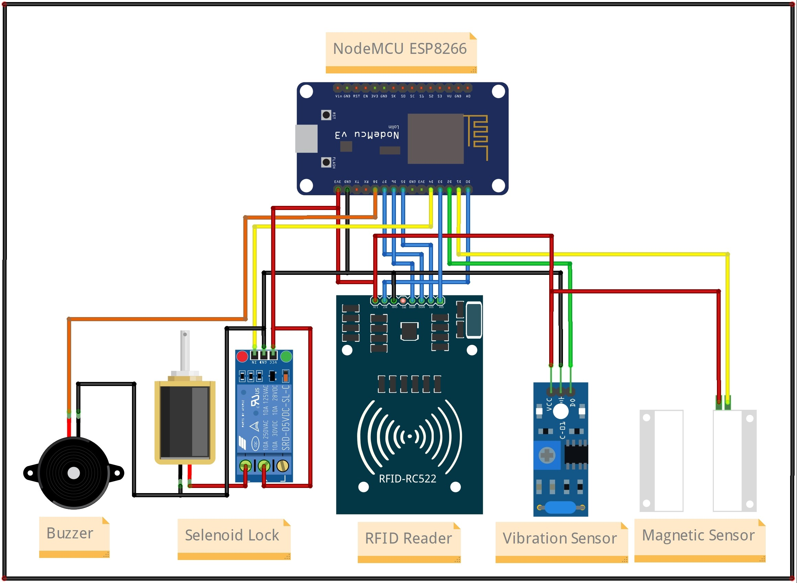

## Sistem Keamanan Kotak Amal

Adalah alat yang berfungsi untuk sistem keamanan kotak amal sebagai salah satu pencegahan jika ada orang yang tidak bertanggung jawab ketika hendak mencuri atau membuka paksa benda tersebut. Secara garis besar prinsip kerja dari alat ini ialah mendeteksi getaran melalui sensor getar dan sensor pintu jika ada yang membuka pintu atau kunci kotak amal tanpa ijin akses. Alat ini sudah terintegrasi dengan Telegram Bot sebagai sarana kontrol dan monitoring pengguna dengan alat, serta juga sudah terintegrasi dengan RFID sebagai akses untuk membuka kunci pintu bagi pengguna yang memiliki akses yang sudah divalidasi atau didaftarkan.

---

### Cara Kerja Alat

Ketika pertama dihidupkan, alat akan mencoba menghubgkan kejaringan WiFi yang sudah dikonfigurasi sebelumnya melalui WiFiManager. Selain untuk kebutuhan konfigurasi WiFi, WiFiManager juga difungsikan untuk melakukan konfigurasi Telegram. Hal ini bertujuan untuk memudahkan pengguna jika suatu saat ingin melakukan perubahan pada konfigurasi tersebut tanpa harus memprogram ulang. Selain itu, tentunya membuat alat semakin fleksibel dan mudah dioperasikan.

Ketika sudah berhasil terhubung kejaringan WiFi, alat akan masuk kedalam mode standby dan siap untuk menerima perintah dari pengguna melalui Telegram, membaca status sensor getar dan sensor pintu serta membaca akses RFID jika suatu ketika ada yang mengkases RFID Reader tersebut.

Melalui Telegram Bot, pengguna dapat melakukan kontrol dan monitoring secara real-time dengan beberapa perintah yang bisa dilakukan oleh alat. Berikut adalah beberapa perintahnya:

- `/unlock` => Untuk membuka kunci pintu.
- `/ensensor` => Untuk mengaktifkan sensor getaran.
- `/disensor` => Untuk menonaktifkan sensor getaran.
- `/status` => Untuk menampilkan informasi status alat.
- `/info` => Untuk menampilkan informasi tentang alat.
- `/reset` => Untuk mengahapus konfigurasi WiFi.

Ketika alat mendeteksi getaran yang mencurigakan, maka secara otomatis alat akan mengirimkan notifikasi berupa pesan ke Telegram pengguna serta mengaktifkan buzzer sebagai indikasi alarm peringatan. Selain itu, sensor pintu juga mempunyai peran penting jika mendeteksi pintu dalam keadaan terbuka tanpa ijin akses yang sah maka secara otomatis juga alat akan mengirim notofikasi berupa pesan ke telegram.
Dan juga ketika ada akses RFID yang tidak sah atau dalam arti lain Tag / Kartu tidak terdaftar maka secara otomatis juga alat akan mengirim notifikasi berupa pesan ke Telegram.

---

### Hardware

- NodeMCU ESP8266
- Active Buzzer
- Selenoid Door Lock
- 1ch Relay 5V
- RFID RC522
- Vibration Sensor
- Magnetic Door Sensor

---

### Wiring Diagram

Berikut adalah wiring diagram dari alat Sistem Keamanan Kotak Amal

    

---

#### Catatan !

Project ini bersifat private, jika anda membutuhkan file lain seperti source-code program dan file pendukung lainnya silahkan hubungi saya melalui tautan sosial media pada bio profile ini.

[Traktir saya kopi](https://www.buymeacoffee.com/thoriktk)

---
