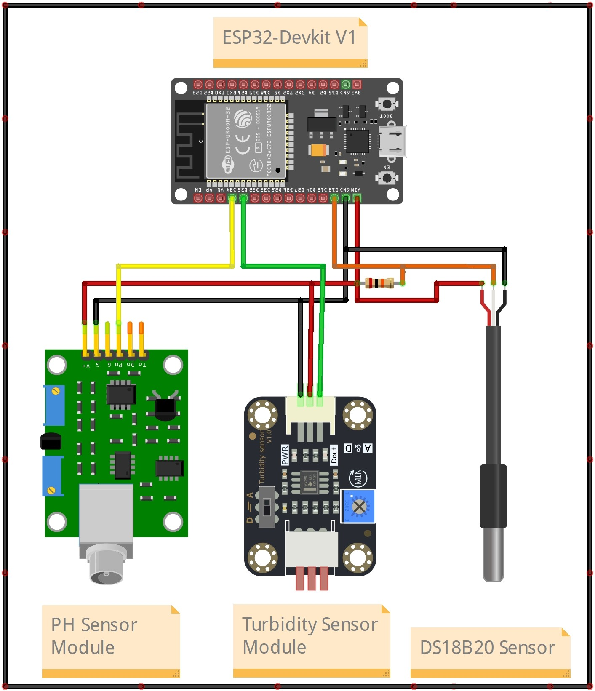

## Sistem Monitoring Suhu Ph Turbidity

Adalah alat yang berfungsi untuk memonitoring nilai Suhu atau Temperature, Nilai Ph dan nilai Turbidity atau kekeruhan suatu cairan. Menggunakan `ESP32` sebagai Microcontroller dan platform `Blynk` berbasis aplikasi mobile sebagai sarana komunikasi antara alat dan pengguna. Selain itu, Blynk juga digunakan sebagai sarana untuk menampilkan data dari setiap sensor. Pegguna juga dapat melakukan setting batas Suhu, batas pH atau batas Turbidity melalui aplikasi Blynk.

---

### Cara Kerja Alat

Ketika pertama dihidupkan, alat akan mencoba menghubungkan ke jaringan WiFi yang sudah dikonfigurasi sebelumnya melalui WiFiManager. Selain konfigurasi WiFi, WiFiManager juga difungsikan untuk proses konfigurasi Blynk. Hal ini bertujuan untuk mempermudah pengguna dalam proses konfigurasi tanpa harus memprogram ulang alat secara langsung. Dan juga membuat alat lebih fleksibel jika sewaktu saat pengguna ingin melakukan perubahan pada konfigurasi-konfigurasi tersebut.

Ketika berhasil terhubung maka alat sudah masuk kedalam posisi standby dan siap memproses data dari Blynk serta membaca nilai data dari beberapa sensor, yaitu sensor Suhu, Sensor pH dan Sensor Turbidity.

Pengguna juga dapat melakukan setting batas nilai pada sensor suhu, sensor pH, dan sensor Turbidity.
Sebagai contoh jika hasil pembacaan sensor suhu melebihi batas yang ditentukan maka alat akan mengirim notifikasi ke aplikasi Blynk bahwa suhu terlalu tinggi dan sebaliknya. Hal ini juga berlaku pada sensor pH dan sensor Turbidity.

---

### Hardware

- ESP32 Devkit V1
- PH4502C pH Sensor Module
- Turbidity Sensor Module
- DS18B20 Waterproof Temperature Sensor

---

### Wiring Diagram

Berikut adalah wiring diagram dari alat Sistem Monitoring Suhu Ph Turbidity

    

---

#### Catatan !

Project ini bersifat private, jika anda membutuhkan file lain seperti source-code program dan file pendukung lainnya silahkan hubungi saya melalui tautan sosial media pada bio profile ini.

[Traktir saya kopi](https://www.buymeacoffee.com/thoriktk)

---
