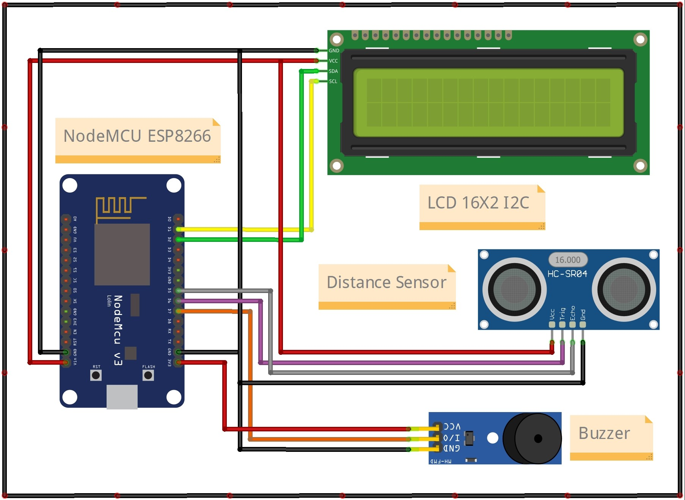

## Sistem Monitoring Ketinggian Air Sungai

Adalah alat yang berfungsi untuk memonitoring keadaan sungai berdasarkan ketinggian air. Selain untuk monitoring, alat ini juga berfungsi untuk sistem deteksi adanya kemungkinan banjir berdasarkan level ketinggian air. Terintegrasi dengan `Blynk` berbasis aplikasi mobile sebagai sarana komunikasi antara pengguna dengan alat. Melalui aplikasi Blynk, pengguna juga dapat melakukan monitoring dan setting level ketinggian sesuai yang dikehendaki. Selain itu, juga terdapat LCD 16X2 untuk menampilkan data dari ketinggian air dan level status ketinggian.

---

### Cara Kerja Alat

Ketika pertama kali dihidupkan, alat akan mencoba menghubungkan ke jaringan WiFi yang sudah dikonfigurasikan. Jika berhasil terhubung, maka alat akan masuk kedalam mode standby dan siap membaca data dari sensor Ultrasonic. Dari hasil pembacaan sensor tersebut, kemudian diproses menjadi data ketinggian dengan satuan cm. Data ketinggian tersebut juga dikirimkan ke aplikasi Blynk.

Setidaknya ada 4 level status ketinggian, yaitu aman, siaga, waspada dan bahaya. Melalui aplikasi Blynk pengguna dapat melakukan setting ketinggian berdasarkan status level yang dikehendaki. Sebagai contoh ketika status level dalam keadaan bahaya, maka alat akan mengirim notifikasi ke pengguna melalui aplikasi Blynk serta menghidupkan Buzzer serta menampilkan data informasi tersebut di LCD.

---

### Hardware

- NodeMCU ESP8266 Dev Board
- Active Buzzer
- HC-SR04 Ultrasonic Distance Sensor
- LCD 16x2 I2C

---

### Wiring Diagram

Berikut adalah wiring diagram dari alat Sistem Monitoring Ketinggian Air Sungai

    

---

#### Catatan !

Project ini bersifat private, jika anda membutuhkan file lain seperti source-code program dan file pendukung lainnya silahkan hubungi saya melalui tautan sosial media pada bio profile ini.

[Traktir saya kopi](https://www.buymeacoffee.com/thoriktk)

---
